# System Architecture Diagram

```mermaid
flowchart TD
  subgraph Frontend
    FE["React Web App"]
  end
  subgraph Backend
    APIGW["API Gateway (FastAPI, async, OpenAPI)"]
    USvc["User Service (FastAPI, Pydantic, async)"]
    AuthSvc["Auth Service (FastAPI, Pydantic, async)"]
    PlaylistSvc["Playlist Service (FastAPI, Pydantic, async)"]
    MusicSvc["Music/Streaming Service (FastAPI, Pydantic, async)"]
    SearchSvc["Search & Recommendation Service (FastAPI, Pydantic, async)"]
    AnalyticsSvc["Analytics Service (FastAPI, Pydantic, async)"]
    WebSocketSvc["WebSocket Gateway (FastAPI, async)"]
    Docs["OpenAPI Docs & Source of Truth"]
    Monitoring["Monitoring & Testing"]
  end
  subgraph Databases
    PG["PostgreSQL"]
    Redis["Redis Cache & Pub/Sub"]
    VecDB["Vector DB (Qdrant/FAISS)"]
  end
  subgraph Storage
    S3["Cloud Storage (S3)"]
    CDN["CDN"]
  end
  FE -- REST/WebSocket --> APIGW
  APIGW -- REST --> USvc
  APIGW -- REST --> AuthSvc
  APIGW -- REST --> PlaylistSvc
  APIGW -- REST --> MusicSvc
  APIGW -- REST --> SearchSvc
  APIGW -- REST --> AnalyticsSvc
  APIGW -- WebSocket --> WebSocketSvc
  USvc -- SQL --> PG
  AuthSvc -- SQL --> PG
  PlaylistSvc -- SQL --> PG
  MusicSvc -- SQL --> PG
  MusicSvc -- Cache/PubSub --> Redis
  SearchSvc -- SQL --> PG
  SearchSvc -- Vector --> VecDB
  AnalyticsSvc -- SQL --> PG
  MusicSvc -- S3 API --> S3
  S3 -- CDN Sync --> CDN
  FE -- Audio Stream --> CDN
  WebSocketSvc -- Real-time --> FE
  AnalyticsSvc -- Events --> Redis
  MusicSvc -- Events --> AnalyticsSvc
  FE -- Upload --> S3
  APIGW -- Docs --> Docs
  USvc -- Docs --> Docs
  AuthSvc -- Docs --> Docs
  PlaylistSvc -- Docs --> Docs
  MusicSvc -- Docs --> Docs
  SearchSvc -- Docs --> Docs
  AnalyticsSvc -- Docs --> Docs
  WebSocketSvc -- Docs --> Docs
  APIGW -- Monitoring --> Monitoring
  USvc -- Monitoring --> Monitoring
  AuthSvc -- Monitoring --> Monitoring
  PlaylistSvc -- Monitoring --> Monitoring
  MusicSvc -- Monitoring --> Monitoring
  SearchSvc -- Monitoring --> Monitoring
  AnalyticsSvc -- Monitoring --> Monitoring
  WebSocketSvc -- Monitoring --> Monitoring
```

## Component Descriptions

- **Frontend (React Web App):**
  - User interface for music discovery, playback, playlists, and social features.

- **API Gateway (FastAPI, async, OpenAPI):**
  - Central entry point for all REST and WebSocket traffic.
  - Routes requests to backend microservices.
  - Exposes OpenAPI documentation for all endpoints.
  - Implements authentication, rate limiting, and request validation.
  - Monitored for performance and errors.

- **User Service (FastAPI, Pydantic, async):**
  - Manages user profiles and subscription tiers.
  - Uses Pydantic for data validation and serialization.
  - Async I/O for scalable request handling.
  - Exposes OpenAPI docs and is fully tested.

- **Auth Service (FastAPI, Pydantic, async):**
  - Handles authentication, authorization, and token management.
  - Pydantic models for all request/response schemas.
  - Async endpoints for login, registration, and token refresh.
  - OpenAPI docs and comprehensive test coverage.

- **Playlist Service (FastAPI, Pydantic, async):**
  - CRUD for playlists, liked songs, and user listening history.
  - Pydantic models for playlist and song schemas.
  - Async endpoints for high concurrency.
  - OpenAPI docs and tested for edge cases.

- **Music/Streaming Service (FastAPI, Pydantic, async):**
  - Handles song metadata, audio streaming, file uploads, and scrubbing.
  - Integrates with S3 for file storage and CDN for delivery.
  - Uses Redis for caching and pub/sub for real-time analytics/events.
  - Async streaming endpoints and OpenAPI docs.

- **Search & Recommendation Service (FastAPI, Pydantic, async):**
  - Full-text and semantic search, AI-powered recommendations.
  - Integrates with Vector DB for embeddings.
  - Async endpoints, Pydantic models, and OpenAPI docs.

- **Analytics Service (FastAPI, Pydantic, async):**
  - Collects and aggregates listening analytics (plays, skips, etc.).
  - Publishes and consumes events via Redis pub/sub.
  - Async endpoints, Pydantic models, and OpenAPI docs.

- **WebSocket Gateway (FastAPI, async):**
  - Real-time updates for play progress, shared listening rooms, and notifications.
  - Uses Redis pub/sub for cross-instance event propagation.
  - OpenAPI docs for WebSocket events and message schemas.

- **OpenAPI Docs & Source of Truth:**
  - All services expose OpenAPI documentation.
  - API contracts, data models, and flows are versioned and documented.
  - Documentation is the source of truth for product behavior and architecture.

- **Monitoring & Testing:**
  - All services are monitored for latency, errors, and throughput.
  - Automated tests (unit, integration, FastAPI test client) are required for all changes.
  - Logging and error handling follow project-approved libraries.

- **PostgreSQL:**
  - Primary relational database for structured data.

- **Redis (Cache & Pub/Sub):**
  - Caching layer for fast access to frequently used data.
  - Pub/Sub for real-time events and cross-service communication.

- **Vector DB (Qdrant/FAISS):**
  - Stores song/user embeddings for AI recommendations.

- **Cloud Storage (S3):**
  - Stores audio files and assets.

- **CDN:**
  - Delivers audio files globally with low latency.

## Documentation & Testing as First-Class Citizens

- All API behaviors, data models, and user flows are documented in OpenAPI and project docs.
- Documentation is always up-to-date and reviewed as part of the development process.
- Testing is mandatory for all new features and changes, following best practices for FastAPI and Python.
- When in doubt, developers consult the documentation and ask for clarification before proceeding. 